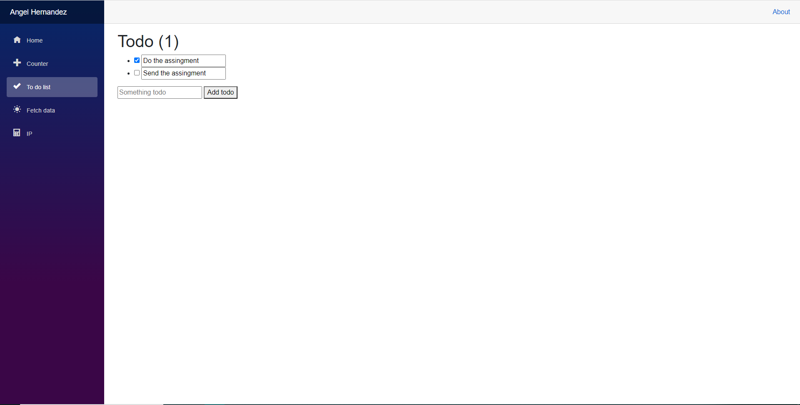

# Deployed App Link
https://white-wave-08cb05a10.azurestaticapps.net/

# Blazor Application

Creator: Angel Hernandez

Tutorials used: https://dotnet.microsoft.com/learn/aspnet/blazor-tutorial/intro       ///         https://devblogs.microsoft.com/aspnet/azure-static-web-apps-with-blazor/
https://docs.microsoft.com/en-us/aspnet/core/tutorials/build-a-blazor-app?view=aspnetcore-5.0&pivots=server
 
 

# Info

This app was created for an assignment in a Programming 2 class. It is a blazor application that builds into a website. It uses HTML, CSS, and C# programming languages. I have completed two courses using C#, so I already knew a thing or two, but it was great to go back. I might come back to update this project in the near future but it is not a priority right now.
